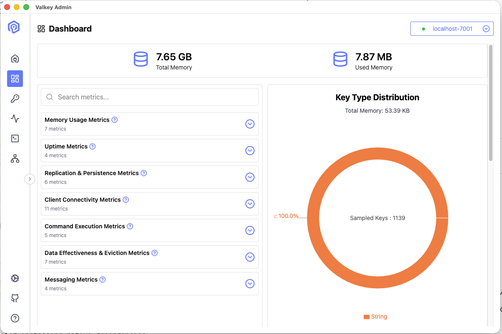
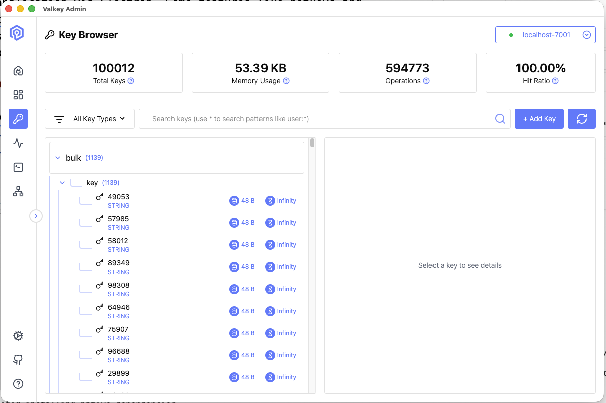
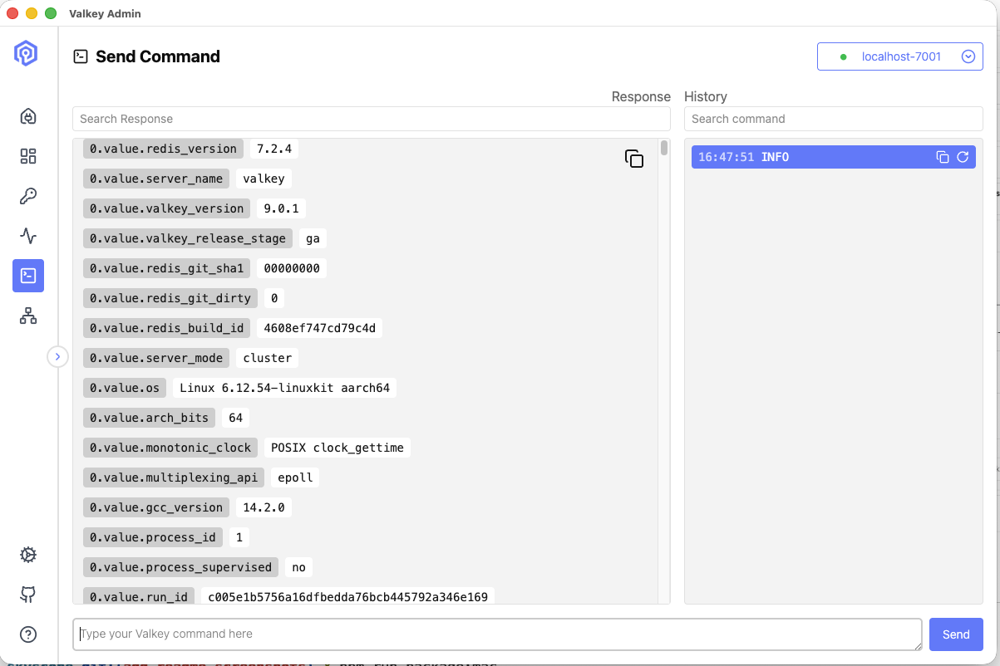
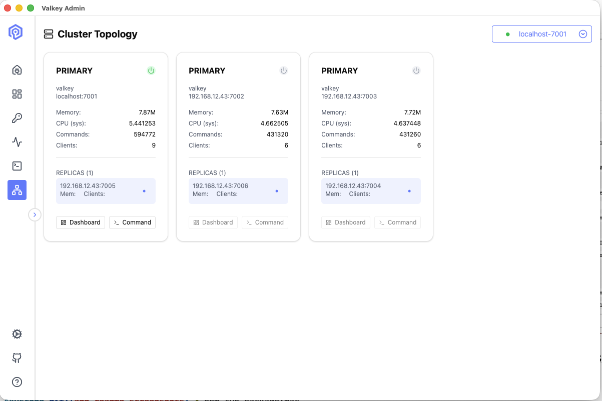
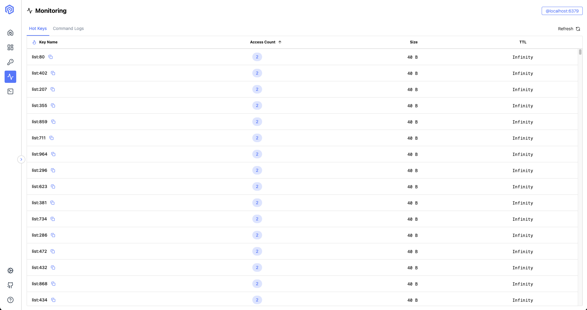
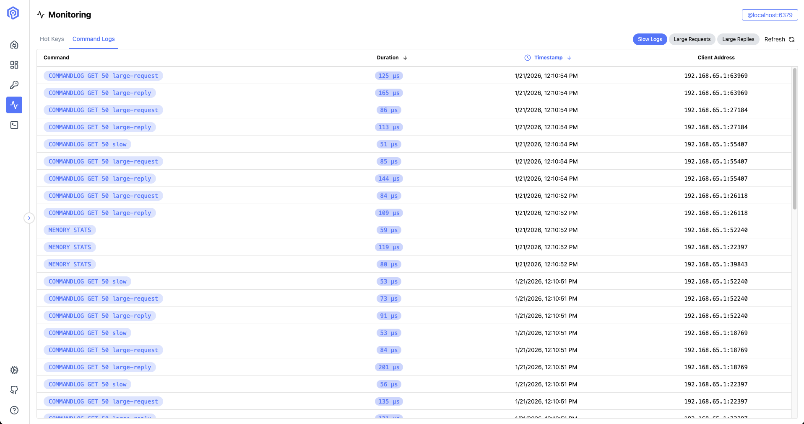
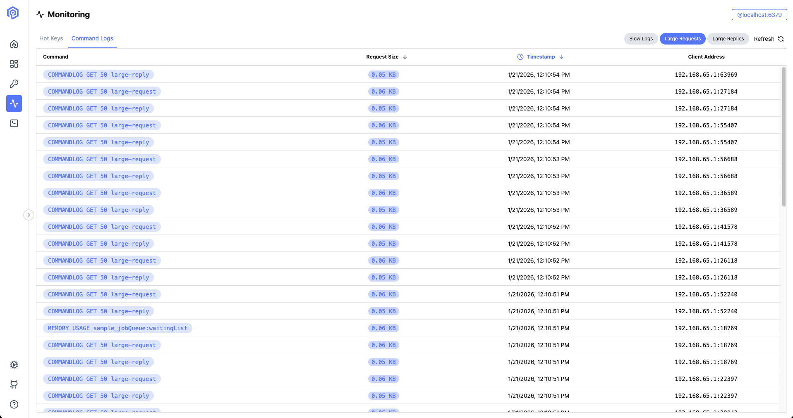
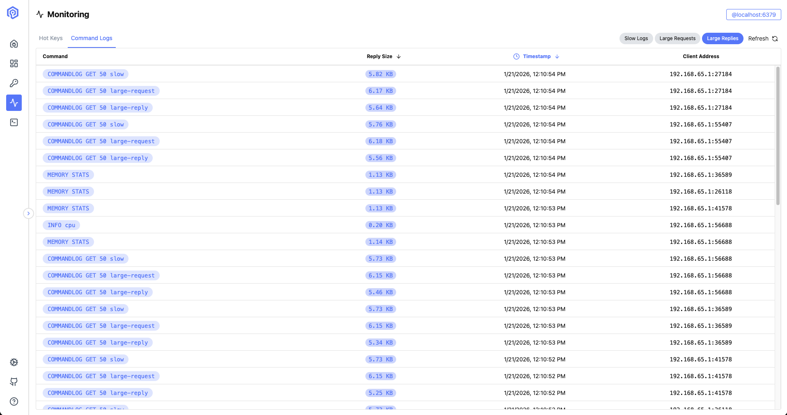

# Valkey Admin

## What is Valkey Admin?

Valkey Admin is a web-based administration tool for Valkey clusters. It provides an intuitive interface to monitor, manage, and interact with your Valkey instances, offering features like real-time metrics and key management.









Built with React and TypeScript, Valkey Admin runs as a desktop application via Electron. Some features like hotkeys and commandlogs rely on Electron, so the app is currently only fully supported as a desktop app. Use the web application for a subset of features.









## Platform Support

Valkey Admin works on:
- **macOS** (native support)
- **Linux** (native support)
- **Windows** (via WSL - Windows Subsystem for Linux)

## Quick Start

```bash
./quickstart.sh
```

This builds the full desktop application with all features (hotkeys, commandlogs, etc.). The app will be built in the `release/` folder with connection instructions.

**For web development only:** Use `./quickstart-web.sh` for the development servers (limited features).

### Running the Built Desktop App

After building, launch the desktop app:

**macOS:**
```bash
open "release/Valkey Admin.app"
```

**Linux:**
```bash
# Make executable and run AppImage
chmod +x "release/Valkey Admin-${VERSION}.AppImage"
./release/Valkey\ Admin-${VERSION}.AppImage

# Or install DEB package
sudo dpkg -i "release/valkey-admin_${VERSION}_amd64.deb"
valkey-admin
```

**Windows:** The desktop app builds for Linux/macOS only. Use `./quickstart-web.sh` for web interface.

### Manual Connection
Once the app is running, manually add a connection to your cluster (default local cluster is usually `localhost:7001`).

## Getting Started

### Prerequisites
- nodejs version v20+

### First install the dependencies
```sh
curl -fsSL https://rpm.nodesource.com/setup_20.x | bash -
dnf install -y nodejs
```

### Then download source and install dependencies
```sh
cd /opt
git clone https://github.com/valkey-io/valkey-admin.git
cd valkey-admin
npm install
```

### Setting up external access in valkey-admin's apps
Manually configure valkey-admin's front-end and server.

vite.config.ts
```sh
cat > apps/frontend/vite.config.ts << 'EOF'
import { defineConfig } from "vite"
import path from "path"
import tailwindcss from "@tailwindcss/vite"
import react from "@vitejs/plugin-react"

export default defineConfig({
  base: "./",
  plugins: [react(), tailwindcss()],
  resolve: {
    alias: {
      "@": path.resolve(__dirname, "./src"),
      "@common": path.resolve(__dirname, "../../common"),
    },
  },
  server: {
    host: "0.0.0.0",
    port: 5173,
  },
})
EOF
```

server/index.ts
```sh
sed -i "s/WebSocketServer({ port: 8080 })/WebSocketServer({ host: '0.0.0.0', port: 8080 })/" \
    apps/server/src/index.ts
```

wsEpics.ts (Configure external access in valkey-admin's apps)
```sh
sed -i 's|ws://localhost:8080|ws://YOUR_IP:8080|' \
    apps/frontend/src/state/epics/wsEpics.ts
```

### Run valkey-admin
```sh
# foreground
npm run dev

# background
nohup npm run dev > /var/log/valkey-admin.log 2>&1 &
```

### Access to the valkey-admin
```sh
valkey-admin WebUI: http://YOUR_IP:5173
Connection Settings:
Host: 127.0.0.1
Port: 6380 (Valkey port)
```

## Contributing
Interested in improving Valkey Admin? Please see our [CONTRIBUTING.md](./CONTRIBUTING.md) for environment setup, WSL instructions, and development workflows.

## License
Valkey Admin is released under the **Apache License 2.0**.
